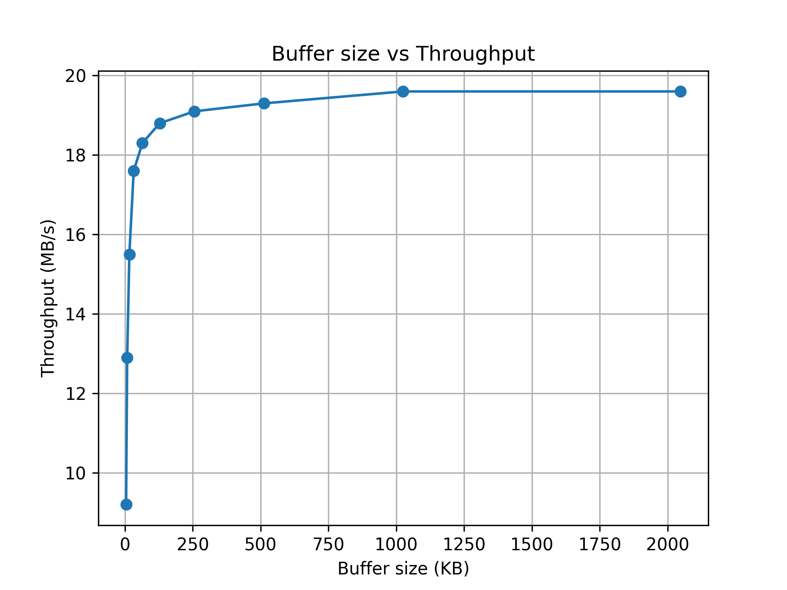
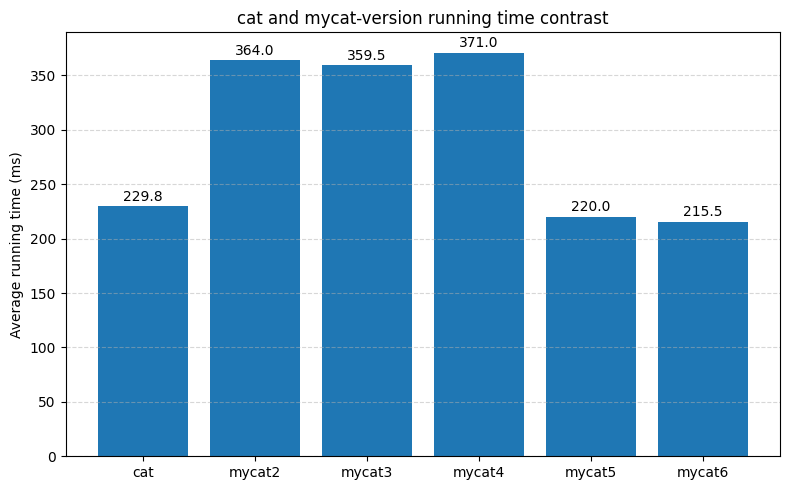

# Report
姓名：王昭阳
学号：2023200403
## Task3

### 1. 为什么将缓冲区对齐到系统的内存可能提高性能？你的实验结果支持这个猜想吗？为什么？

(1)避免跨越两个物理页带来的额外页表访问或 TLB miss。如果底层I/O驱动或DMA硬件对齐到页边界更高效，aligned buffer 可以减少不必要的复制或额外的缓冲拷贝。
(2)看到 mycat3 比 mycat2 略微提升


###  2.为什么我们直接使用malloc函数分配的内存不能对齐到内存页，即使我们分配的内存大小已经是内存页大小的整数倍了。

因为malloc返回地地址通常是按照8/16字节对齐的，但是他不保证返回地地址对齐到系统页边界，因为malloc管理堆区域内部碎片，可能需要多个请求服务，对齐到页会浪费小块内存

### 3. 如何在不知道 malloc 返回指针的前提下正确释放 align_alloc 分配的内存？

将malloc返回的原始指针orig存在对齐地址之前的位置
```c
((void**)aligned)[-1] = orig;
```
然后再align_free中就可以：
```c
void *orig = ((void**)ptr)[-1];
free(orig);
```

## Task4

### 1. 为什么在设置缓冲区大小时需要考虑文件系统块大小

因为当缓冲区大小时文件系统块大小的整数倍时，内核可以整块地执行读取和写入提高页面命中率，预读效率等，提升整体的效率

### 2.两个注意事项
（1）使用fstat(fd)来获取具体文件的st_blksize

(2)取page和fsblk的最大公约数，使其能够满足双方对齐

## Task5

### 脚本逻辑解释
Task5中我在修改过原代码中的变量后设计脚本思路很简单：

```c
echo "scale_factor,buf_bytes,throughput_MBps" > "$OUT_CSV"

for sf in 1 2 4 8 16 32 64 128 256 512; do
  bs=$(( BASE * sf ))
  out=$( $TEST_CMD bs=$bs count=65536 2>&1 )
  thr=$( echo "$out" | grep copied | awk '{print $(NF-1)}' )
  echo "${sf},${bs},${thr}" >> "$OUT_CSV"
done

echo "测试完成，结果保存在 $OUT_CSV"
```
1. 按2的幂次来遍历倍数
2. 用dd来测量速度
3. 计算thr吞吐速率
结果如下：


##　Task6

### 1.如何设置fadvise参数

```c
posix_fadvise(fd, 0, 0, POSIX_FADV_SEQUENTIAL);
```
这里offset和len设置均为0，并且按顺序读取，表示告诉内核提前进行预读来优化读取性能

### 2.关于顺序读写和随机读写对readahead调整

顺序访问启动readahead,减少I/O等待。
随机访问则关闭，即将提示符更换为POSIX_FADV_RANDOM

## Task7总结

对于全程的柱状图其实还是比较出乎意料的，可能是我方法有些小问题？

Task3 中进行缓冲区的分配后cat效率只有很小的提升,但是这是可以接受的，因为我举得逻辑上这里的缓冲对于实际的运行效果只有很小的影响，他还有很大的优化空间。

但是task4让我感到十分疑惑，这一步按理来说是在Task3基础上的优化才对，但是我尝试了几种方法比如（a）取最大公约数，(b)取更大值，(c)对更大值取临近的2次幂，三个方法的效率彼此之间差不是特别多，我对这些方法进行了多次运行，平均下来三个的平均运行时间是a < b < c 取最大公约数在这里的效果是最好的，但是这依旧在Task3任务的运行时间之上，对结果产生了负面影响。
然后我通过分析认为应该是选择的块的大小未必适配这些文件，当这些文件的最终块太小会导致频繁的读写增加成本。太大可能对小文件或者缓存并不友好，所以固定页大小可能稳定性会更好。


Task6中我应用fadvise告诉内核顺序读取文件，内核增大readahead大小，以此来减短运行时间。
我的各部分mycat平均运行时间表如下：

总而言之，本次的作业整体的流程对我来说循序渐进的，更实际的认识了这方面的知识，难度还不高，赞👍